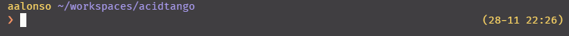
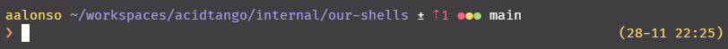
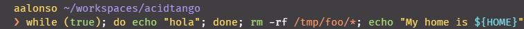
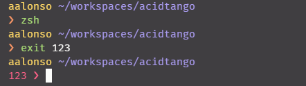
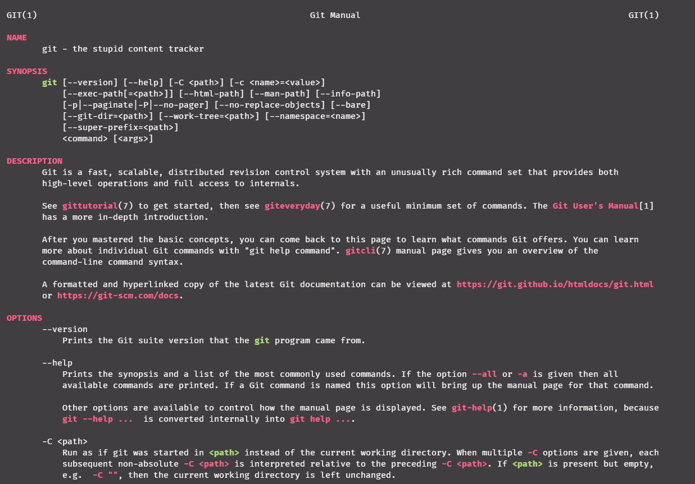

# Aitor Alonso's ZSH config

This is the config I use for a ZSH shell running in a Ubuntu (Windows Subsystem for Linux 2), where I do daily work for Acid Tango.

Main features are:

- Modular config. Take whatever file or plugin you want.
- Separated files for aliases (`.aliases`) and environment (`.env`)
- Some utils commands in `.aliases` file to do hacky things
- Man pages with colors to an easier reading
- Shows exit code when it differs from zero
- Syntax highlighting for cli commands and reserved words like for, do, done, if, etc.
- Git status info in prompt
- Auto-correct typos when running a command

See `.zsh/config/options.zsh` for a quick look to native ZSH options set.

All files inside this folder should be placed in your `$HOME` directory

## Images gallery

### _This is my prompt when in a directory:_

### _And this when in a git repository:_

Legend:
- Red numbers with up arrow indicates there is N commits in local not in origin
- Blue numbers with down arrow indicates there is N commits in origin not in local
- Red dot indicates new files not being following by git
- Yellow dot indicates modifications to a file followed by git
- Green dot indicates modifications staged for commit

### _Auto-correct example:_

### _Syntax highlighting example:_

### _Non-zero exit code:_

### _Man pages color example:_

